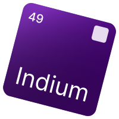

<div>

</div>

Indium is a dead simple backend library inspired by [Express](https://github.com/expressjs/express) and powered by [Lune](https://lune-org.github.io/docs)

It aims to provide you with all the convenient tools to reduce pain while remaining lightweight.

## Installation
Either clone repository or use pesde:
```
pesde add intervinn/indium
```

## Quick Example
```luau
local Indium = require("Package")

local app = Indium.App.new()

-- middleware
app.router:use(function(req, res, next)
    print(req.method, req.path)
    next()
end)

-- routing
app.router:get("/", function(req, res)  
    res:status(200):json({
        message = "hello, world"
    })
end)

-- serving
app:listen(8080, function()  
    print("up")
end)
```

Dynamic routing is also available:
```luau
local Indium = require("../..")

local users = Indium.Router.new()
users:get("/:username", function(req, res)
    res:status(200):json({
        message = `you might be looking for {req.params.username}`
    })
end)

local app = Indium.App.new()
app.router:mount(users, "/users")

app.router:get("/", function(req, res)
    res:status(200):json({
        message = "hello, world"
    })
end)

app:listen(8080, function()
    print("up")
end)
```

Some middleware can improve your experience:
```luau
local Indium = require("../..")

local app = Indium.App.new()

app.router:use(Indium.Middleware.Logger.new())
app.router:use(Indium.Middleware.CORS.new({
    origin = "*"
}))

app:listen(8080, function()
    print("up")
end)
```

You can split some of your code into separate routers, and then unite them all:
```luau
local Indium = require("../..")

local users = Indium.Router.new()
users:get("/:username", function(req, res)
    res:status(200):json({
        message = `you might be looking for {req.params.username}`
    })
end)

local app = Indium.App.new()
app.router:mount(users, "/users")

app.router:get("/", function(req, res)
    res:status(200):json({
        message = "hello, world"
    })
end)

app:listen(8080, function()
    print("up")
end)
```


# State of Indium
It's raw and needs improvements, contributions would be welcome

Many inspiration on code structuring was taken from [DiscordLuau](https://github.com/DiscordLuau/discord-luau).

